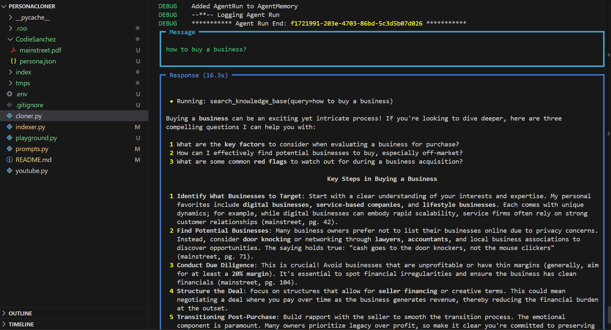

# Persona Cloner

## Overview
The Persona Cloner is a Python application designed to create and manage persona-based agents that mimic the style and knowledge of specified personas. It utilizes various tools and libraries to facilitate the creation of intelligent agents capable of engaging in meaningful conversations.

## Features
- **Agent Creation**: Create agents that can respond in the style of specified personas.
- **Knowledge Base Integration**: Utilize a vector database to store and retrieve knowledge relevant to the personas.
- **Tool Integration**: Access external tools such as DuckDuckGo and Wikipedia for enhanced responses.
- **Memory Management**: Retain memories from previous interactions to personalize user experiences.

## Installation
1. Clone the repository:
   ```bash
   git clone https://github.com/yourusername/PersonaCloner.git
   cd PersonaCloner
   ```

2. Install the required packages:
   ```bash
   pip install -r requirements.txt
   ```

3. Set up environment variables in a `.env` file:
   ```
   QDRANT_API_KEY=your_api_key
   QDRANT_URL=your_qdrant_url
   ```

## Usage
To run the Persona Cloner, use the following command:
```bash
python cloner.py --persona "PersonaName" --server
```
- Use `--server` to run the FastAPI server.
- Use `--debug` to run the playground app in debug mode.

## Key Steps in Buying a Business
1. **Identify What Businesses to Target**: Understand your interests and expertise.
2. **Find Potential Businesses**: Use networking and door knocking to discover opportunities.
3. **Conduct Due Diligence**: Avoid unprofitable businesses and ensure clean financials.
4. **Structure the Deal**: Focus on seller financing and creative terms.
5. **Transitioning Post-Purchase**: Build rapport with the seller for a smooth transition.

## Related Topics
- Understanding seller financing options.
- Key financial metrics to evaluate during due diligence.
- Strategies for a smooth business transition post-purchase.

## Example Output


In the example we can see a folder that includes a book and a JSON file describing the persona and its sources. The persona information can be found in the following file:
- [index/persona.json](index/persona.json)

## License
This project is licensed under the MIT License - see the [LICENSE](LICENSE) file for details.
